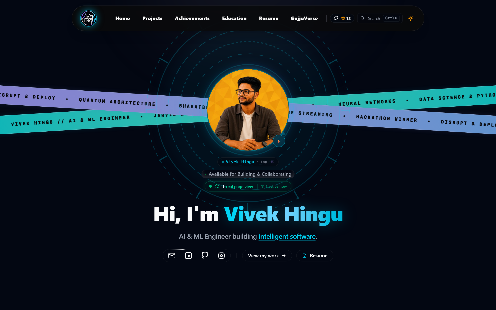
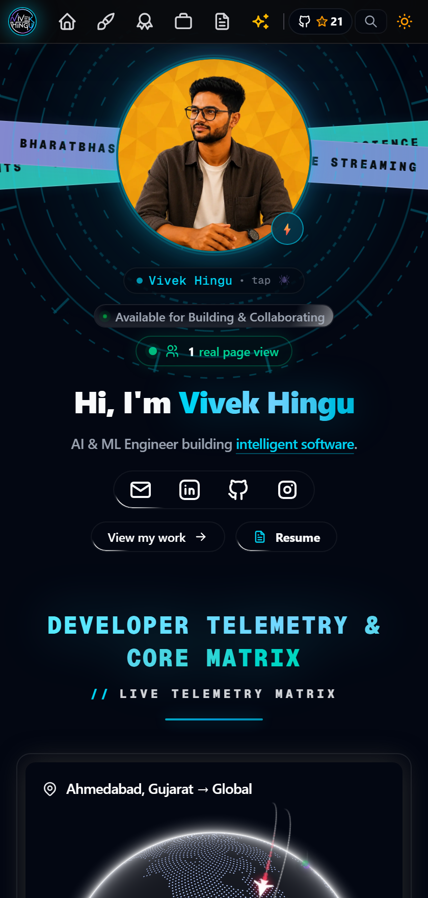
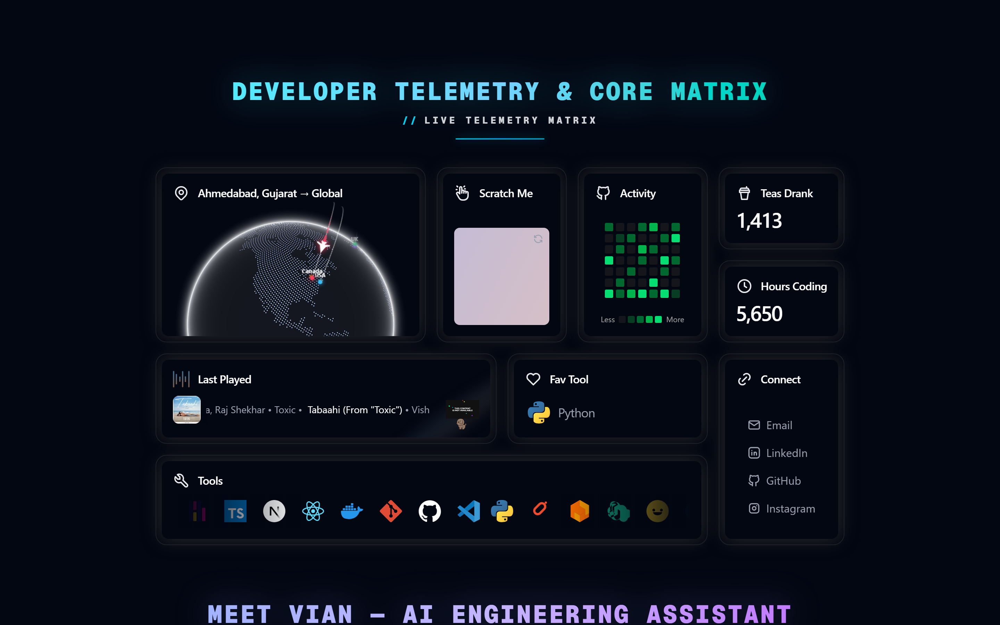
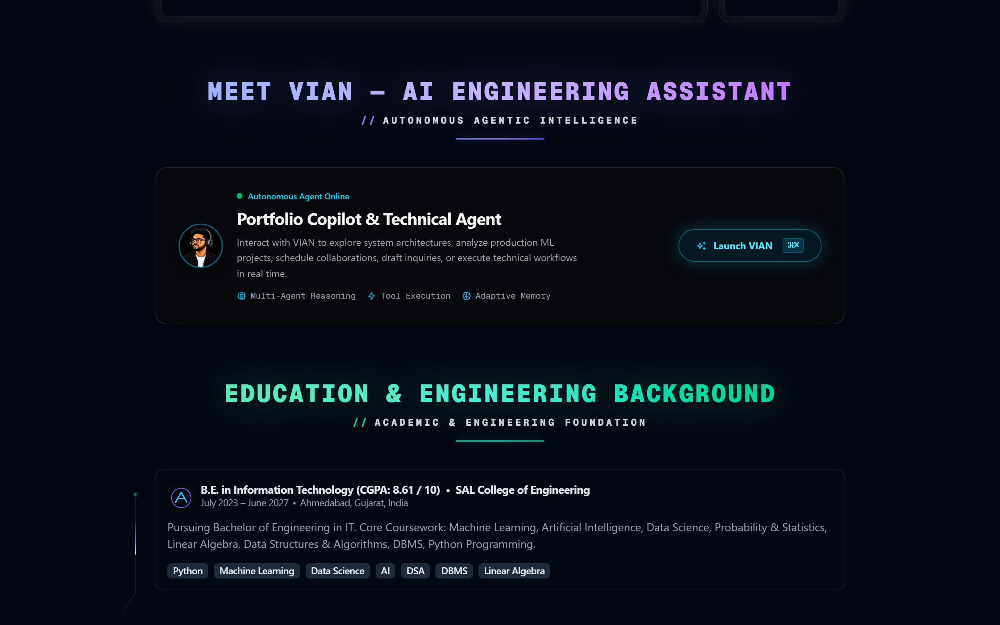
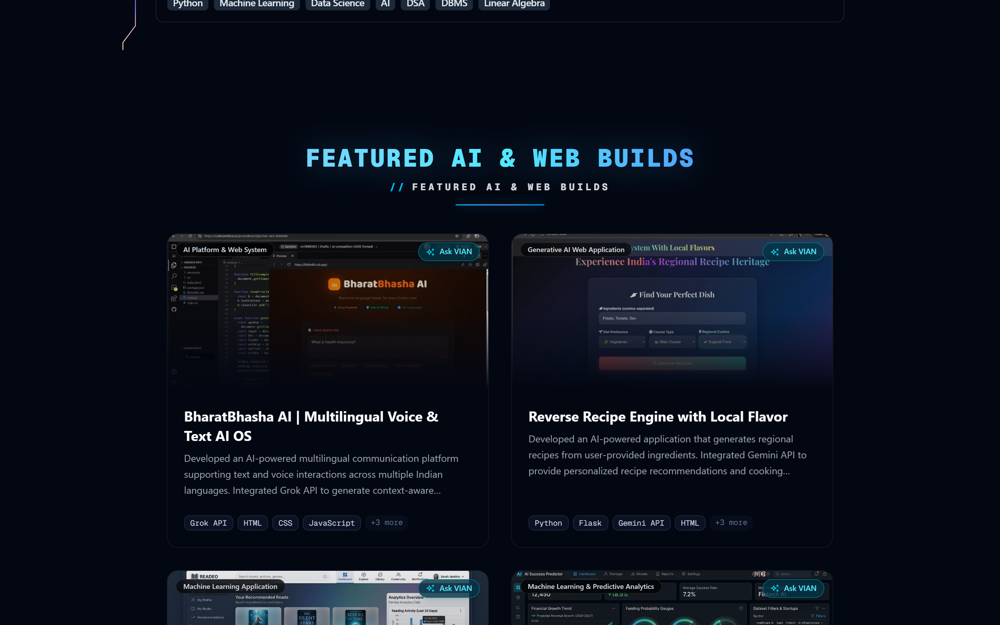
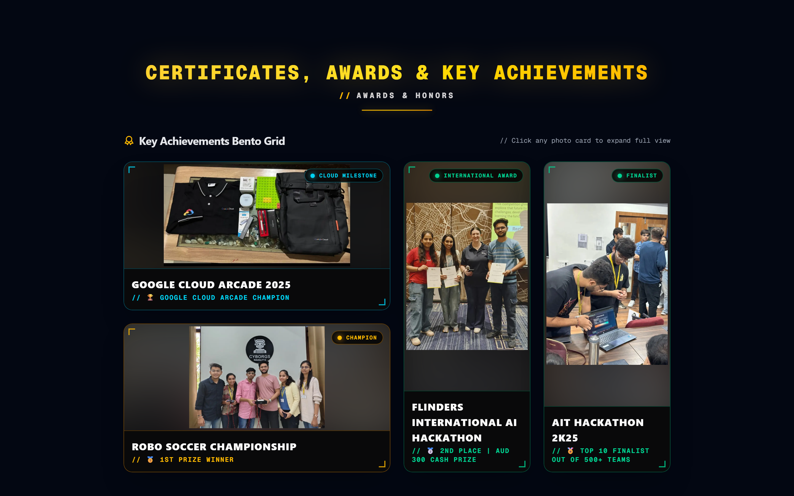
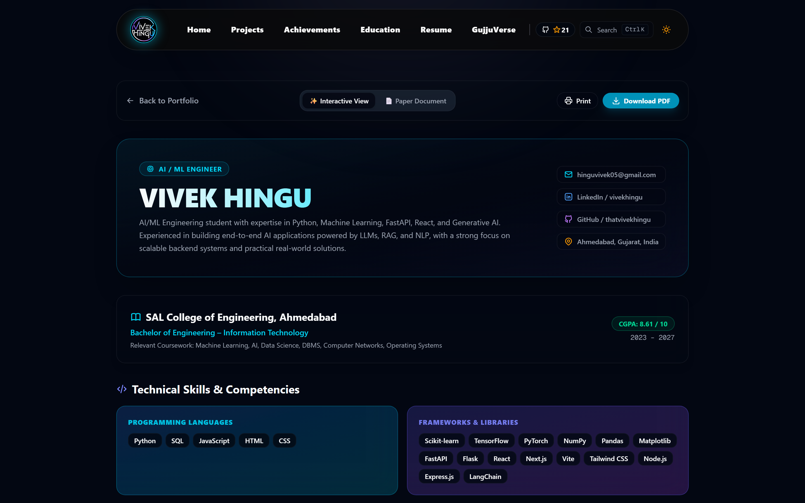

<div align="center">

# ⚡ Vivek Hingu — AI/ML Engineer & Full-Stack Developer

A high-performance, ultra-modern personal portfolio website engineered with **Next.js 15**, **React 19**, **TypeScript**, and **Tailwind CSS**. Featuring interactive AI showcase architectures, live telemetry matrix dashboard with a 4-flight 3D globe, dual-persona superhero avatar, 41-meme scratch card, native iPhone AI assistant (VIAN), and interactive 3D resume viewer.

<br />

[**🌐 Live Website**](https://vivekhingu.vercel.app/) • [**📄 Interactive Resume**](https://vivekhingu.vercel.app/resume) • [**🤖 Meet VIAN AI Copilot**](https://vivekhingu.vercel.app/#vian-assistant)

<br />

[](https://vivekhingu.vercel.app/)
&nbsp;
[](https://nextjs.org/)
&nbsp;
[](https://react.dev/)
&nbsp;
[](https://www.typescriptlang.org/)
&nbsp;
[](https://tailwindcss.com/)
&nbsp;
[](https://github.com/thatvivekhingu/thatvivekhingu-PFL/stargazers)
&nbsp;
[](./LICENSE)

</div>

---

## 📸 Portfolio Showcase & Live Previews

### 🖥️ 1. Ultra-Modern Hero Section & Marvel Arc Core
Featuring full-bleed dual-angled tech ribbons, concentric Marvel Arc Reactor coordinate rings, and interactive dual-persona avatar.

<div align="center">
  
</div>

<br />

### 📱 2. Mobile Responsive & Touch-Optimized Persona Experience
Optimized for mobile touchscreens with haptic feedback, floating micro-badges, and smart 2.8s auto-revert timers so alter-ego personas never get frozen during scroll or touch.

<div align="center">
  
</div>

<br />

### 🌐 3. Developer Telemetry & Core Matrix (Bento Grid)
Live telemetry dashboard featuring:
- **Interactive 3D Globe**: 4 global flight trajectories originating from Ahmedabad (India) to America, UK, Germany, and Canada.
- **Scratch-to-Reveal Card**: Curated 41 developer memes library with pastel gradient coating, haptic feedback, and instant random rotation.
- **Live Spotify Player**: Real-time song tracking with album artwork and animated soundwave monitor.
- **WakaTime & GitHub**: Live coding telemetry and commit activity heatmap.
- **Developer Tools Marquee**: Interactive toolbelt with custom tooltips.

<div align="center">
  
</div>

<br />

### 🤖 4. VIAN — AI Engineering Copilot
An autonomous engineering assistant with multi-agent reasoning, interactive iOS/macOS interface, dynamic soundwave synthesis, and real-time portfolio querying.

<div align="center">
  
</div>

<br />

### 🚀 5. Featured AI & Machine Learning Builds
Production-grade AI platforms including Startup Predictor, BharatBhasha AI 2.0, Reverse Recipe Engine, and Smart Book Recommender.

<div align="center">
  
</div>

<br />

### 🏆 6. Key Achievements Bento Vault
Dark frosted-glass frames with neon corner brackets showcasing major international hackathons, Google Cloud accolades, and robotics championships.

<div align="center">
  
</div>

<br />

### 📄 7. Interactive & Document Resume Suite
Dual-mode resume viewer supporting live skill category filtering, printable layout, and direct high-res PDF downloads.

<div align="center">
  
</div>

---

## ✨ Architectural Highlights & Features

| Feature | Description |
| :--- | :--- |
| **Edge-to-Edge Ribbons** | Full-bleed dual-angled tech ribbons (-3.5° / +3.5°) with high-contrast typography and infinite marquee animation. |
| **Marvel Arc Reactor Orbit** | Centered concentric sci-fi rings and iconic Avengers coordinate geometry rotating smoothly behind the profile avatar. |
| **Interactive Superhero DP** | Seamless crossfade between **Vivek Hingu** ⚡ and **Desi Karodiya** 🕷️ (*Spider-Man*) with haptic vibrations and a 2.8s auto-revert timer on mobile touch. |
| **4-Flight 3D Globe** | WebGL interactive globe rendering individual flight arcs from **Ahmedabad, India** to **USA**, **UK**, **Germany**, and **Canada**. |
| **41-Meme Scratch Card** | HTML5 canvas scratch-to-reveal card containing 41 local developer memes with pastel gradient coating and instant shuffle. |
| **VIAN AI Assistant** | Full-duplex conversational agent simulating native iOS Siri audio synthesis, tool execution, and architecture walkthroughs. |
| **Developer Telemetry** | Live WakaTime metrics, Spotify audio streaming telemetry, and GitHub activity heatmap. |
| **Bento Achievements Vault** | Neon corner-bracket frosted cards with uncropped high-resolution photos and milestone tags. |
| **GujjuVerse & Earth Archive** | Cultural storytelling section celebrating Gujarat's architecture, street vibes, and landscape photography. |

---

## 🛠️ Tech Stack & Dependencies

- **Frontend Core**: [Next.js 15 (App Router)](https://nextjs.org/), [React 19](https://react.dev/), [TypeScript](https://www.typescriptlang.org/)
- **Styling & UI Components**: [Tailwind CSS](https://tailwindcss.com/), CSS Modules, Glassmorphism design tokens
- **Animations & Visual Effects**: [Framer Motion](https://www.framer.com/motion/), Motion v12, HTML5 Canvas, WebGL 3D Globe
- **Icons & Graphics**: [Tabler Icons](https://tabler.io/icons), Lucide Icons
- **Audio & Haptics**: Web Audio API Sound Synthesizer, `navigator.vibrate` Haptic Engine
- **Hosting & CI/CD**: [Vercel](https://vercel.com/)

---

## 🚀 Getting Started Locally

### Prerequisites
- **Node.js**: v18.x or higher
- **Package Manager**: `npm` or `pnpm`

### Installation

```bash
# 1. Clone repository
git clone https://github.com/thatvivekhingu/thatvivekhingu-PFL.git
cd thatvivekhingu-PFL

# 2. Install dependencies
npm install

# 3. Start local development server
npm run dev
```

Open [http://localhost:3000](http://localhost:3000) in your browser to explore the portfolio locally.

### Production Build

```bash
# Run production compilation and bundle optimization
npm run build

# Start production server
npm run start
```

---

## 👤 About the Author

**Vivek Hingu**  
*AI / ML Engineer & Full-Stack Developer*  
- 🎓 **Education**: B.E. in Information Technology (CGPA: 8.61 / 10) @ SAL College of Engineering  
- 📧 **Email**: [hinguvivek05@gmail.com](mailto:hinguvivek05@gmail.com)  
- 💼 **LinkedIn**: [linkedin.com/in/vivekhingu](https://linkedin.com/in/vivekhingu)  
- 🐙 **GitHub**: [github.com/thatvivekhingu](https://github.com/thatvivekhingu)  
- 🌐 **Portfolio**: [vivekhingu.vercel.app](https://vivekhingu.vercel.app/)  

---

## 📄 License

Distributed under the **Apache License 2.0**. See the [`LICENSE`](./LICENSE) file for complete details.

<div align="center">
  <sub>Engineered with precision & ❤️ by <b>Vivek Hingu</b></sub>
</div>
