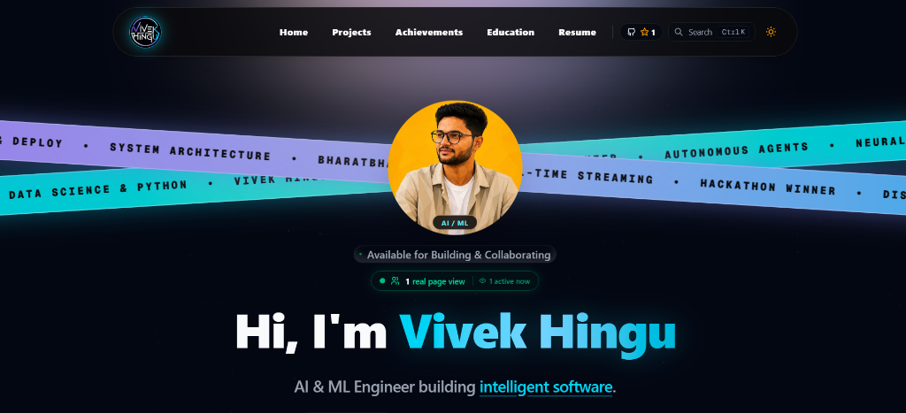
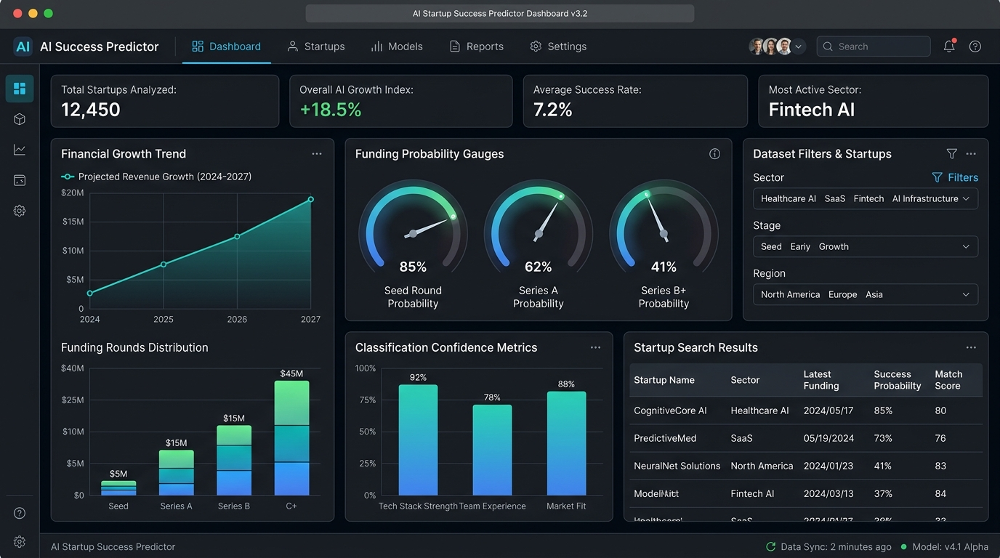
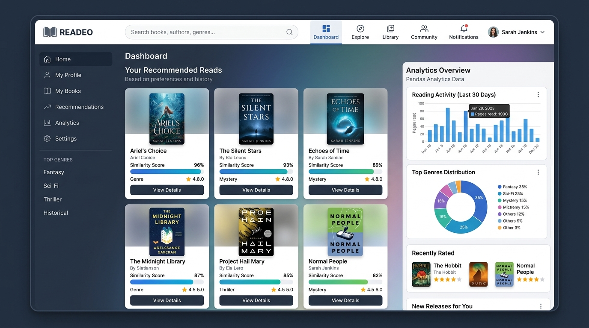
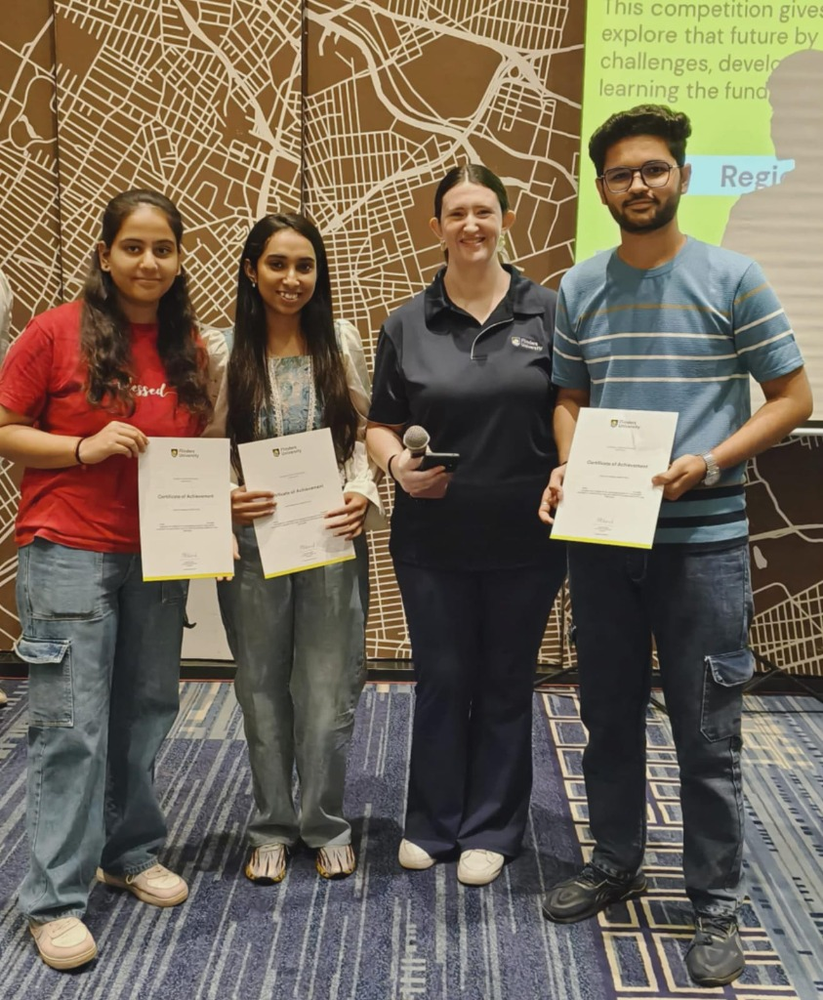

<div align="center">

# ⚡ Vivek Hingu — AI/ML Engineer & Full-Stack Portfolio

A high-performance, ultra-modern personal portfolio website built with **Next.js 15**, **React 19**, **TypeScript**, and **Tailwind CSS**. Featuring interactive AI showcase sections, live telemetry telemetry dashboard, custom Bento grids, native iPhone AI assistant experience (VIAN), and a interactive 3D resume viewer.

[**🌐 Live Demo**](https://vivekhingu.vercel.app/) • [**📄 View Resume**](https://vivekhingu.vercel.app/resume) • [**🤖 Chat with VIAN AI**](https://vivekhingu.vercel.app/)

<br />

[](https://vivekhingu.vercel.app/)
&nbsp;
[](https://github.com/thatvivekhingu/thatvivekhingu-PFL/stargazers)
&nbsp;
[](./LICENSE)

</div>

---

## 📸 Website Showcase & Previews

### 🖥️ Website Interface
<div align="center">
  
</div>

<br />

### 🤖 Featured AI & Machine Learning Builds

| **AI Startup Success Predictor** | **BharatBhasha AI 2.0** |
|:---:|:---:|
|  |  |
| *ML Classification Engine for Startup Risk & Success* | *Multilingual NLP & Voice Communication Platform* |

| **Reverse Recipe Engine with Local Flavor** | **Smart Book Recommender System** |
|:---:|:---:|
|  |  |
| *Generative AI Ingredient-to-Recipe System (AIT Top 10 Finalist)* | *Collaborative & Content-Based Book Filtering Engine* |

<br />

### 🏆 Key Achievements Bento Grid

| **Google Cloud Arcade Champion 2025** | **Flinders Int'l AI Hackathon (2nd Place)** |
|:---:|:---:|
|  |  |
| *Cloud & AI Milestones* | *AUD 300 Cash Prize Winner* |

| **AIT Hackathon 2K25 (Top 10 Finalist)** | **Robo Soccer Championship (1st Prize)** |
|:---:|:---:|
|  |  |
| *Selected out of 500+ competing teams* | *CYBORGS Robotics Winner* |

---

## ✨ Key Features & Sections

- **Full-Bleed Viewport Ribbons**: Hero section featuring animated edge-to-edge tech ribbons.
- **Developer Telemetry Matrix**: Live WakaTime metrics, Spotify Last Played widget, interactive Scratch-to-Reveal card, and developer tools marquee.
- **VIAN AI Native Experience**: iPhone-styled interactive AI Assistant simulating iOS native Siri/VIAN interface with full voice & text synthesis.
- **Achievements Bento Grid**: Dark frosted glass photo frames with neon corner brackets showcasing un-cropped high-res achievement photos.
- **3D Certifications Carousel**: Interactive flip cards verifying NPTEL, freeCodeCamp, IBM, and LetsUpgrade credentials.
- **Interactive & Document Resume Viewer**: Dedicated page and modal with live skill filtering, print capability, and direct PDF download.
- **Atmospheric Archive (Earth Visuals)**: Custom imagery gallery capturing culture, architecture, and landscapes.

---

## 🛠️ Tech Stack & Architecture

- **Core**: [Next.js 15](https://nextjs.org/) (App Router), [React 19](https://react.dev/), [TypeScript](https://www.typescriptlang.org/)
- **Styling**: [Tailwind CSS](https://tailwindcss.com/), CSS Modules, Glassmorphism design tokens
- **Animations**: [Framer Motion](https://www.framer.com/motion/), Motion v12, Canvas Constellations, Shimmer Borders
- **Icons**: [Tabler Icons](https://tabler.io/icons)
- **Deployment**: [Vercel](https://vercel.com/)

---

## 🚀 Getting Started

### Prerequisites
- Node.js 18.x or later
- npm or pnpm package manager

### Local Installation

```bash
# 1. Clone the repository
git clone https://github.com/thatvivekhingu/thatvivekhingu-PFL.git
cd thatvivekhingu-PFL

# 2. Install dependencies
npm install

# 3. Start development server
npm run dev
```

Open [http://localhost:3000](http://localhost:3000) in your browser to view the application locally.

### Production Build Verification

```bash
# Linting and Type checking
npm run lint

# Compile production build
npm run build
```

---

## 👤 Author

**Vivek Hingu**  
- **Role**: AI/ML Engineer & Full-Stack Developer  
- **Education**: B.E. Information Technology (8.61 CGPA) @ SAL College of Engineering  
- **Email**: [hinguvivek05@gmail.com](mailto:hinguvivek05@gmail.com)  
- **LinkedIn**: [linkedin.com/in/vivekhingu](https://linkedin.com/in/vivekhingu)  
- **GitHub**: [github.com/thatvivekhingu](https://github.com/thatvivekhingu)  

---

## 📄 License

Distributed under the **Apache License 2.0**. See [`LICENSE`](./LICENSE) for more information.

<div align="center">
  <sub>Designed & Developed with ❤️ by <b>Vivek Hingu</b></sub>
</div>
